# 🔐 Better Auth Authentication Starter

<p align="center">
  A production-ready authentication starter built with <strong>Next.js 15</strong>, <strong>Better Auth</strong>, <strong>MongoDB</strong>, and <strong>Nodemailer</strong>.
  Now featuring new-device login alerts and IP-based rate limiting.
</p>

<p align="center">


</p>

---

## ✨ Overview

A complete, production-ready authentication starter using the **Next.js 15 App Router**, **Better Auth**, and **MongoDB**.

Includes secure email/password auth, Google & GitHub OAuth, OTP email verification, password recovery, Two-Factor Authentication (2FA), a full security dashboard with persistent login history, security activity audit logs, paginated connected devices, Role-Based Access Control with dedicated Admin/User dashboards, and a modular component architecture powered by **Server Actions**.

---

## 📸 Platform Previews & Features

### 🔐 Authentication Flow
A complete, secure authentication flow including login, registration, and OTP email verification. It supports email/password and OAuth (Google & GitHub).
<p align="center">
  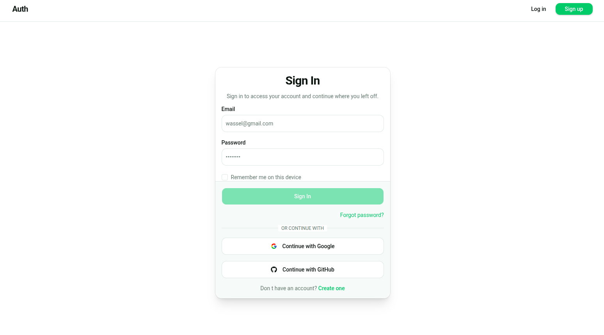
  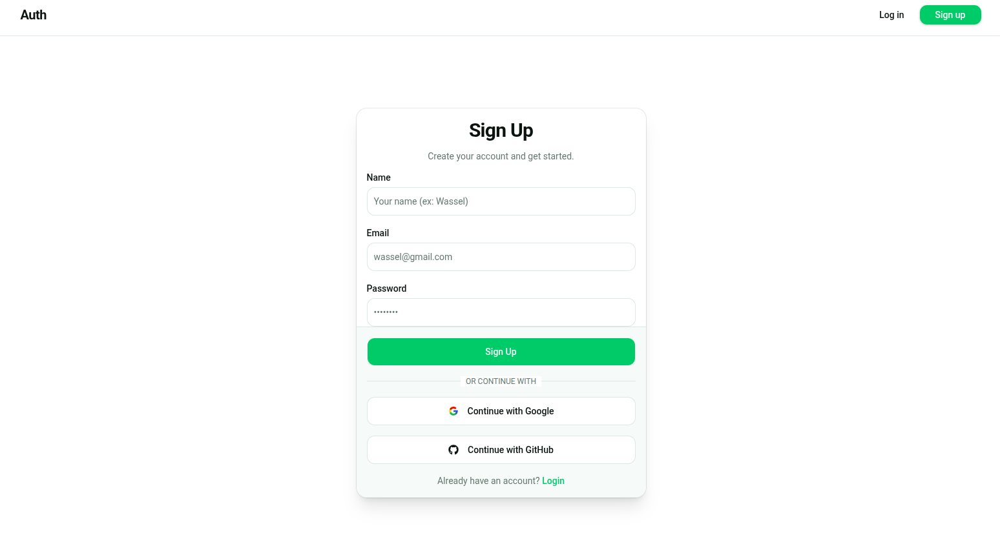
</p>

### 🎛️ User Dashboard
A clean and responsive dashboard showcasing the user's role, personal information, and quick access to account settings via an intuitive dropdown menu.
<p align="center">
  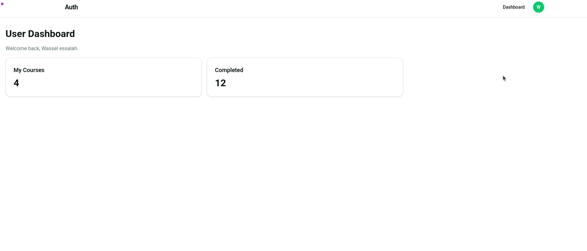
  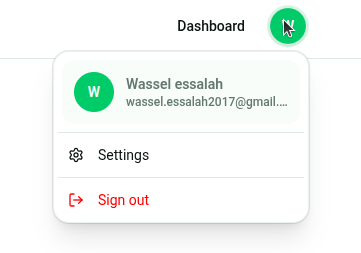
</p>

### 🛡️ Security Dashboard
A comprehensive security hub where users can monitor their account's safety. It displays active sessions, connected devices, and allows users to sign out from all other devices remotely.
<p align="center">
  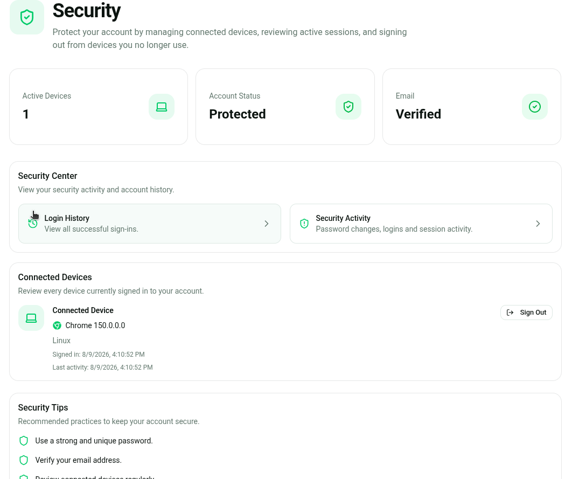
  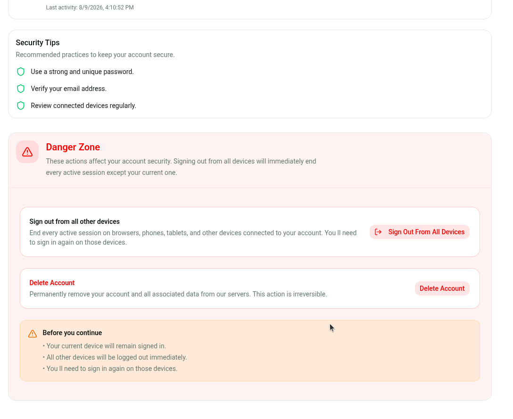
</p>

### 📱 Two-Factor Authentication (2FA)
Enhance account security with TOTP-based Two-Factor Authentication. Users can scan a QR code with an Authenticator app, verify OTPs, and generate recovery backup codes.
<p align="center">
  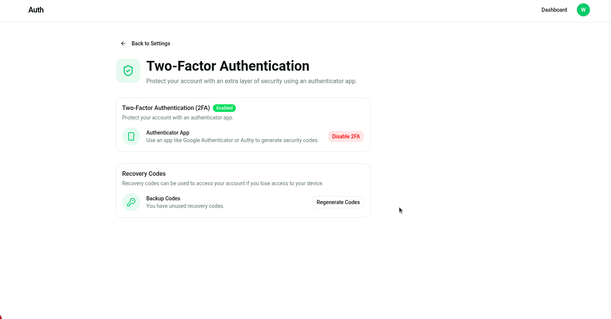
  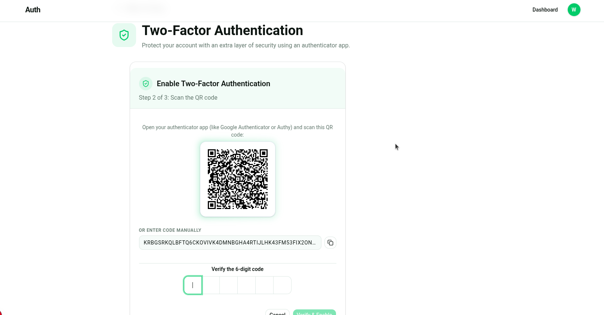
</p>

### ⚙️ Account Management
Secure interfaces for sensitive account operations, such as changing your password (with real-time strength meter) or securely updating your email address.
<p align="center">
  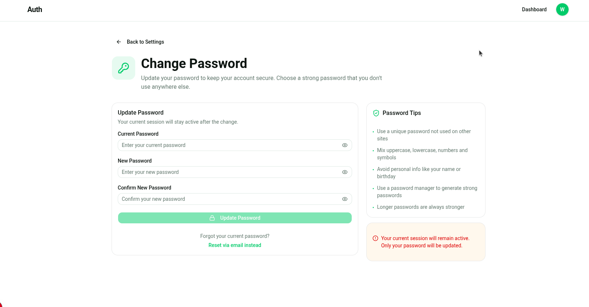
  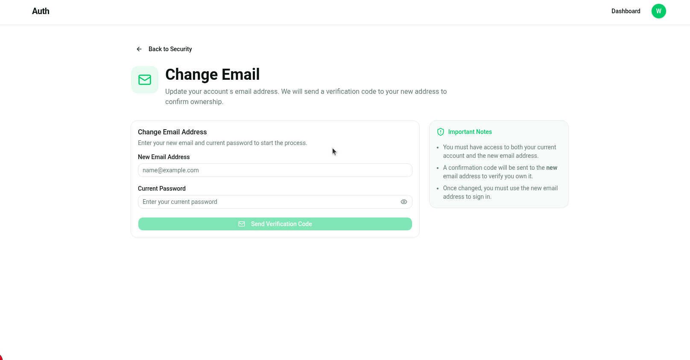
</p>

### 📋 Audit & Security Logs
A persistent, detailed record of all security events. It tracks login history, browser, OS, IP address, and security actions (e.g., password changes) with paginated views.
<p align="center">
  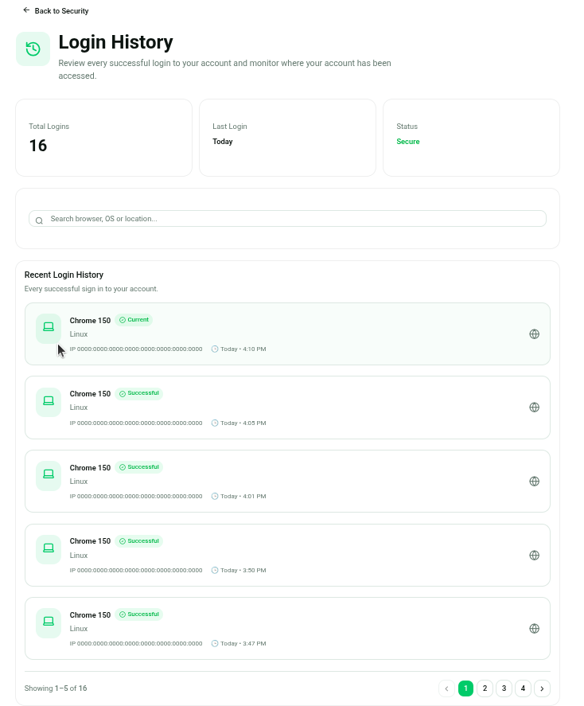
  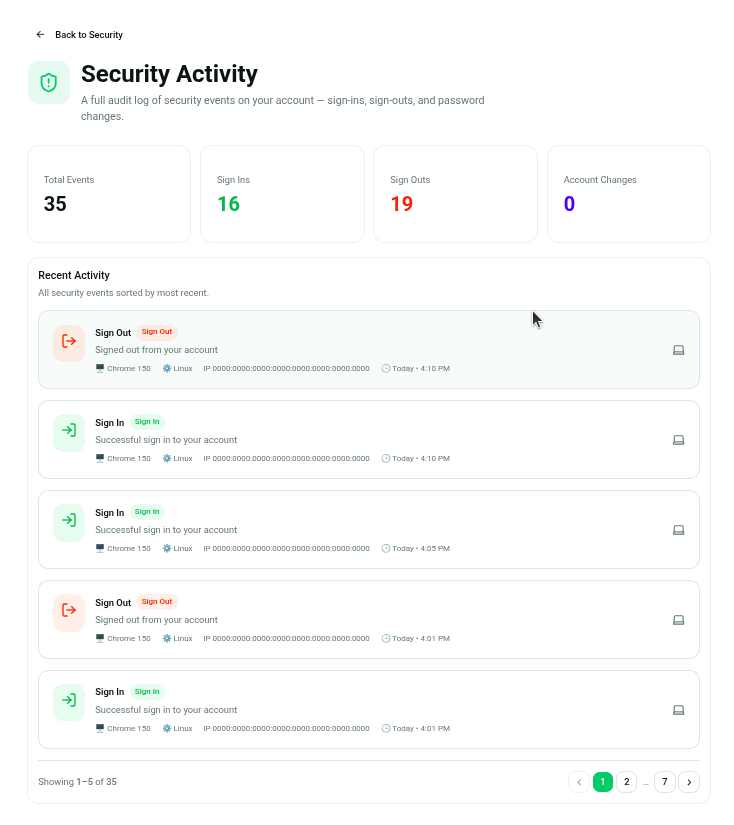
</p>

### ⚠️ Danger Zone
A protected section for critical and irreversible actions like account deletion, requiring password verification for safety.
<p align="center">
  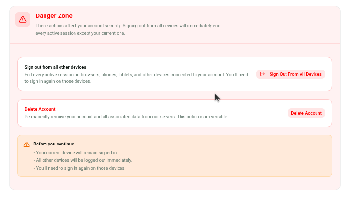
</p>

---

## 🚀 Highlights

| | Feature |
|---|---|
| 🔐 | Complete Authentication System |
| 🌍 | Google & GitHub OAuth |
| ✉️ | Email Verification with OTP |
| 🔑 | Password Recovery via Email |
| 🛡️ | Full Security Dashboard |
| 💻 | Connected Devices Management |
| 📋 | Persistent Login History |
| 🔍 | Security Activity Audit Log |
| 🔒 | Password Strength Meter |
| 📄 | Pagination on all list views |
| ✉️ | Change Email with OTP & Security Alerts |
| 🗑️ | Secure Account Deletion |
| 💾 | Remember Me Functionality |
| 🔔 | New Device Login Email Alert |
| 🚦 | IP-based Login Rate Limiting |
| 🛡️ | Two-Factor Authentication (2FA) |
| 👥 | Role-Based Access Control (Admin/User) |
| 🎛️ | Dedicated Admin & User Dashboards |
| ⚡ | Server Actions Architecture |
| 📱 | Fully Responsive UI |
| 🎨 | Modern UI with shadcn/ui |
| 🧩 | Clean & Modular Component Architecture |

---

## ✅ Features

### Authentication
- Email & Password Sign Up / Sign In
- Remember Me functionality (persistent sessions)
- Google OAuth
- GitHub OAuth
- Logout (single device or all devices)
- Session Management
- Protected Routes via Middleware
- **IP-based rate limiting** on login (5 attempts / 15 min — sliding window, zero dependencies)
- **New device login alert** — email sent automatically when a sign-in is detected from an unrecognised User-Agent

### Email Verification
- 6-digit OTP code
- SHA-256 OTP hashing
- OTP expiration (10 minutes)

### Password Management
- Forgot Password flow
- Reset Password via email token
- Change Password (with live strength meter)
- Show/hide password toggle on all fields
- Session stays active after password change

### Email System
- Nodemailer SMTP integration
- Verification email template
- Forgot Password email template
- Reset Password email template
- Change Email verification template
- Security Alert template (sent to old email upon change)
- **New Device Login Alert** template (browser, OS, IP, timestamp + fraud warning block)
- HTML email templates

### 🛡️ Security Dashboard
- Connected Devices list (paginated)
- Current device/session detection
- Revoke individual sessions
- Logout from all other devices
- Browser, OS & device type detection
- IP address display
- Session creation & last activity timestamps
- Confirmation dialogs before destructive actions
- Secure account deletion (danger zone) with password verification

### 📋 Login History
- Permanent record (survives session expiry/revocation)
- Dedicated MongoDB `loginHistory` collection
- Recorded on every sign-in via `databaseHooks`
- Browser, OS & device parsed from User-Agent
- IP address tracking
- Live client-side search (by browser, OS, IP)
- Current session badge
- Human-readable timestamps (Today, Yesterday, date)
- Paginated (5 per page)

### 🔍 Security Activity
- Full audit log of all security events
- Tracks: Sign In, Sign Out, Password Change, Email Change
- Dedicated MongoDB `securityActivity` collection
- Colour-coded badges (🟢 sign in · 🟠 sign out · 🔵 password change · 🟣 email change)
- Stats cards: Total Events, Sign Ins, Sign Outs, Password/Email Changes
- Paginated (5 per page)

### 🔒 Password Change Page
- Live strength indicator (5-segment animated bar)
- Real-time rules checklist (length, uppercase, lowercase, digit, special char)
- Match indicator on confirm field
- Show/hide toggle on all 3 password fields
- Tips sidebar with password best practices
- Redirects to Security page after success

### Developer Experience
- Next.js 15 App Router
- Server Actions
- TypeScript (strict, zero errors)
- Tailwind CSS v4
- shadcn/ui
- Modular component architecture
- Reusable `Pagination` component

---

## 🛠 Tech Stack

| Technology | Purpose |
|------------|---------|
| Next.js 15 | Framework (App Router) |
| TypeScript | Type safety |
| Better Auth | Authentication engine |
| MongoDB | Database |
| Nodemailer | Email delivery |
| Tailwind CSS v4 | Styling |
| shadcn/ui | UI components |
| Lucide React | Icons |
| ua-parser-js | User-Agent parsing |
| npm | Package manager |

---

## 📂 Project Structure

```text
src
├── actions
│   └── auth
│       ├── forgot-password
│       │   ├── forgot-password.ts
│       │   └── reset-password.ts
│       │
│       ├── security
│       │   ├── get-sessions.ts
│       │   ├── get-login-history.ts
│       │   ├── get-security-activity.ts
│       │   ├── revoke-session.ts
│       │   └── revoke-all-sessions.ts
│       │
│       ├── change-email
│       │   ├── request-change-email.ts
│       │   └── verify-change-email.ts
│       │
│       ├── password-update
│       │   └── password-update.ts
│       │
│       ├── sign-in
│       │   ├── email-sign-in.ts
│       │   ├── github-sign-in.ts
│       │   └── google-sign-in.ts
│       │
│       ├── sign-up
│       │   └── email-sign-up.ts
│       │
│       └── verify-email
│           └── verify-email.ts
│
├── app
│   ├── (auth)
│   │   ├── forgot-password
│   │   ├── reset-password
│   │   ├── sign-in
│   │   ├── sign-up
│   │   ├── verify-reset-password
│   │   └── layout.tsx
│   │
│   ├── (protected)
│   │   ├── dashboard
│   │   ├── settings
│   │   │   ├── profile
│   │   │   ├── email
│   │   │   │   └── page.tsx
│   │   │   ├── password
│   │   │   └── security
│   │   │       ├── page.tsx
│   │   │       ├── login-history
│   │   │       │   └── page.tsx
│   │   │       └── security-activity
│   │   │           └── page.tsx
│   │   │
│   │   ├── verify-email
│   │   └── layout.tsx
│   │
│   ├── api
│   │   └── auth
│   │       ├── change-email
│   │       │   ├── request
│   │       │   │   └── route.ts
│   │       │   └── verify
│   │       │       └── route.ts
│   │
│   ├── error.tsx
│   ├── loading.tsx
│   ├── not-found.tsx
│   ├── layout.tsx
│   └── page.tsx
│
├── components
│   ├── password
│   │   ├── password-input.tsx
│   │   ├── password-strength-bar.tsx
│   │   └── password-tips.tsx
│   │
│   ├── security
│   │   ├── login-history
│   │   │   ├── device-icon.tsx
│   │   │   ├── login-history-list.tsx
│   │   │   ├── login-history-row.tsx
│   │   │   ├── login-history-search.tsx
│   │   │   └── login-history-stats.tsx
│   │   │
│   │   ├── security-activity
│   │   │   ├── activity-list.tsx
│   │   │   ├── activity-row.tsx
│   │   │   └── activity-stats.tsx
│   │   │
│   │   ├── connected-devices.tsx
│   │   ├── danger-zone.tsx
│   │   ├── security-links.tsx
│   │   ├── security-overview.tsx
│   │   ├── session-card.tsx
│   │   └── sign-out-all-devices.tsx
│   │
│   ├── ui
│   │   ├── pagination.tsx       ← shared paginator
│   │   └── ... (shadcn/ui)
│   │
│   ├── change-email-form.tsx
│   └── change-password-form.tsx
│
├── lib
│   ├── auth
│   │   └── auth.ts              ← databaseHooks config (new-device detection)
│   ├── email
│   │   ├── change-email.ts
│   │   ├── new-device-login.ts  ← new device alert email template
│   │   ├── notify-old-email.ts
│   │   └── reset-password.ts
│   ├── rate-limiter.ts          ← in-memory sliding-window rate limiter
│   ├── mailer.ts
│   └── db.ts
│
├── hooks
├── middleware
└── providers
```

---

## 🔐 Authentication Flow

```text
Sign Up
   │
   ▼
Create Account
   │
   ▼
Generate OTP → Hash (SHA-256) → Store → Send Verification Email
   │
   ▼
User Verifies Email
   │
   ▼
Sign In → Dashboard
```

---

## 🔑 Forgot Password Flow

```text
Enter Email
   │
   ▼
Generate Reset Token → Send Reset Email
   │
   ▼
User Clicks Link → Verify Token
   │
   ▼
Create New Password → Sign In
```

---

## 🛡️ Session & Audit Flow

```text
User Signs In
   │
   ▼
POST /api/auth/sign-in/email
   │
   ▼
Rate Limiter (IP, 5 req / 15 min sliding window)
   │
   ├── BLOCKED ──► 429 Too Many Requests + Retry-After header
   │
   └── ALLOWED ──► better-auth sign-in handler
                        │
                        ▼
Create Session ──► databaseHooks.session.create.after
   │                       │
   │                       ├──► loginHistory    { userId, sessionToken, ip, userAgent, createdAt }
   │                       ├──► securityActivity { userId, type: "sign_in", ip, userAgent, createdAt }
   │                       └──► New device? (userAgent not seen before for this user)
   │                                └──► sendNewDeviceLoginEmail  { browser, os, ip, timestamp }
   ▼
Session Active
   │
   ▼
Revoke Session ──► databaseHooks.session.delete.after
                           └──► securityActivity { userId, type: "sign_out", createdAt }

Password Changed (via updatePassword action)
   └──► securityActivity { userId, type: "password_change", ip, userAgent, createdAt }

Email Changed (via verifyChangeEmail action)
   ├──► securityActivity { userId, type: "email_change", ip, userAgent, createdAt }
   └──► sendEmailChangeNotification to old email
```

---

## 🔒 Security Measures

- HTTP-only session cookies
- Protected routes via middleware
- Email verification required before access
- Secure password hashing (via Better Auth)
- SHA-256 OTP hashing with expiration
- Password reset tokens with expiration
- Session revocation (individual & all devices)
- Current session identification
- Persistent login history (survives session expiry)
- Security activity audit log (sign-in, sign-out, password changes)
- Event-driven logging via `databaseHooks` (non-blocking — never interrupts auth flow)
- **IP-based rate limiting** on `/api/auth/sign-in/email` — 5 attempts per 15 min (sliding window, in-memory, zero external deps)
- **New device login email alert** — fires when a User-Agent is seen for the first time per user account
- **Two-Factor Authentication (2FA)** — TOTP/Authenticator App with Backup Codes support
- **Role-Based Access Control (RBAC)** — Native admin/user roles with dedicated dashboards and hard client/server route protection
- TypeScript strict mode — zero type errors
- Server Actions for all mutations

---

## 📦 Installation

```bash
# Clone
git clone https://github.com/wasselessalah/nextjs-better-auth.git
cd nextjs-better-auth

# Install
npm install
```

---

## ⚙️ Environment Variables

Create a `.env.local` file:

```env
# MongoDB
MONGODB_URI=

# Better Auth
BETTER_AUTH_SECRET=
BETTER_AUTH_URL=http://localhost:3000

# Nodemailer (SMTP)
EMAIL_USER=
EMAIL_PASS=

# Google OAuth
GOOGLE_CLIENT_ID=
GOOGLE_CLIENT_SECRET=

# GitHub OAuth
GITHUB_CLIENT_ID=
GITHUB_CLIENT_SECRET=
```

> **Note:** When using Gmail, `EMAIL_PASS` must be a **Google App Password**, not your regular Gmail password. [Create one here →](https://myaccount.google.com/apppasswords)

---

## 🚀 Running the Project

```bash
# Development
npm run dev

# Production
npm run build
npm run start

# Lint
npm run lint
```

---

## 📈 Rate Limiting

| Action | Limit | Implementation |
|--------|-------|----------------|
| **Sign In** | **5 attempts / 15 min / IP** | **✅ Implemented** — sliding window in `src/lib/rate-limiter.ts`, enforced in `[...all]/route.ts` |
| Sign Up | 5 requests / hour / IP | Recommended |
| Verify OTP | 5 attempts | Recommended |
| Forgot Password | 3 requests / hour | Recommended |
| Reset Password | Token expires after 10 min | ✅ Implemented via better-auth |

> **Implementation note:** The rate limiter uses an in-memory sliding-window `Map`. It requires no external dependencies and works perfectly for single-instance deployments. For multi-instance or serverless environments, swap the `store` for [Upstash Redis](https://upstash.com) — the `rateLimit()` interface remains identical.

---

## 🌐 OAuth Providers

| Provider | Status |
|----------|--------|
| Email & Password | ✅ |
| Google | ✅ |
| GitHub | ✅ |

---

## 🚀 Deployment

| Platform | Notes |
|----------|-------|
| ▲ Vercel | Recommended — zero config with Next.js |
| 🚂 Railway | Good for full-stack with MongoDB |
| 🎨 Render | Free tier available |
| 🐳 Docker | Use the provided Dockerfile |
| ☁️ AWS / Azure / GCP | Enterprise deployments |

---

## 📚 Documentation Links

- [Better Auth](https://better-auth.com)
- [Next.js 15](https://nextjs.org/docs)
- [MongoDB](https://www.mongodb.com/docs)
- [Nodemailer](https://nodemailer.com)
- [shadcn/ui](https://ui.shadcn.com)
- [Tailwind CSS](https://tailwindcss.com)

---

## 🤝 Contributing

Contributions are welcome!

1. Fork the repository
2. Create a feature branch (`git checkout -b feat/my-feature`)
3. Commit your changes (`git commit -m 'feat: add my feature'`)
4. Push to the branch (`git push origin feat/my-feature`)
5. Open a Pull Request

---

## 📄 License

Licensed under the **MIT License**.

---

## ⭐ Support

If you find this project useful, please give it a **⭐ Star** on GitHub — it helps a lot!

---

<p align="center">
  Made with ❤️ by <strong>Essalah Wassel</strong>
  using <strong>Next.js</strong>, <strong>Better Auth</strong>, <strong>MongoDB</strong>, <strong>Nodemailer</strong>, and <strong>TypeScript</strong>.
</p>